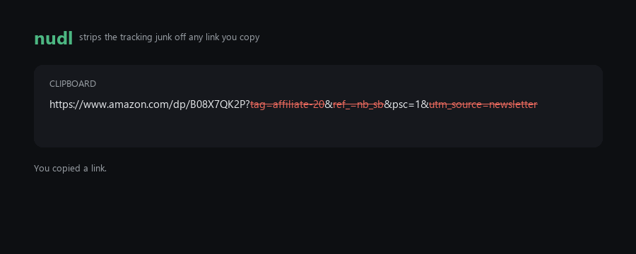

# nudl

**nudl** (*"naked URL"*, pronounced *noodle*) strips the tracking junk off any link you copy —
in Slack, Discord, a terminal, a doc, your browser — and hands back **the same real link,
trimmed**.



Note what *survives*: `psc=1` is a real parameter the link needs, so nudl leaves it alone. It
strips only what it recognises as tracking, and nothing else.

```
https://l.facebook.com/l.php?u=https%3A%2F%2Fsite.com%2Fx&h=AT1
                        ->  https://site.com/x
```

Redirect wrappers get unwrapped too — the output is the destination they were hiding.

It is **not** a URL shortener. No alias, no server, no redirect — the output *is* the real
destination, just shorter. The link can't rot, because it was never replaced.

**Two ways to use it:** press a hotkey (`Ctrl+Alt+V`), or turn on automatic mode and every link
is cleaned the moment you copy it, in any app.

## nudl never sends your URLs anywhere

The cleaning engine makes **zero network calls**. No account, no telemetry, nothing leaves your
machine. That's not a policy, it's a property of the code: the test suite replays every URL in
the corpus with the socket layer patched to explode on any connection attempt.

There's a local audit log at `%AppData%\nudl\clean.log` recording every change nudl has made
(`timestamp · original · what was removed · result`), so you can check its work rather than
trust it.

Deliberately absent: no network un-shortening of `bit.ly` / `t.co` (it would leak the link and
can burn one-time URLs), and no "check for rule updates" (it would mean phoning home).

## The one promise

**nudl never silently breaks a link you needed.** Everything below serves that.

- **When in doubt, do nothing.** A malformed URL, a signed URL, a domain *you've* excluded, a
  result identical to the input, or any internal error — nudl leaves your clipboard exactly as
  it found it.
- **Signed URLs are never touched.** Anything carrying `sig`, `signature`, `hmac`, `token`,
  `expires`, `policy`, or an `X-Amz-*` key is left alone. Signed URLs compute their signature
  over the whole query, so removing *any* parameter turns the link into a 403.
- **Only known trackers are stripped.** nudl works from a small allowlist and never guesses,
  which is why YouTube's `?v=` and `?t=`, Spotify's `?si=`, `?page=`, `?q=` and everything
  nobody has thought of yet survive by default.
- **Values are never rewritten.** Only the *key* of each parameter is inspected, so a parameter
  whose value merely looks like a tracker (`?redirect=utm_source_page`) can't be mangled, and
  `%20` never quietly becomes `+`.
- **Every real change is loud and reversible.** A toast says what was removed; one click — or
  the hotkey again within three seconds — restores the exact original bytes. A no-op is silent:
  if nudl changed nothing, you'll never know it ran.

## Install

Windows 11 (Windows 10 best-effort). No Python needed — everything is bundled.

**Download the [latest release](https://github.com/Coreho/nudl/releases/latest)**, unzip it
anywhere, and run `nudl.exe`.

It's an unsigned build, so SmartScreen will show *"Windows protected your PC."* Click
**More info → Run anyway**. See [Is it safe?](#is-it-safe) — I'd rather tell you up front than
have you find out.

Or with [Scoop](https://scoop.sh):

```
scoop install https://raw.githubusercontent.com/Coreho/nudl/master/scoop/nudl.json
```

From source (Python 3.11+):

```
git clone https://github.com/Coreho/nudl.git
cd nudl
python -m venv .venv
.venv\Scripts\pip install -e .
.venv\Scripts\pythonw -m src.app
```

## Use

On first launch nudl asks how it should work: **Hotkey** (copy a link, press `Ctrl+Alt+V`) or
**Automatic** (links are cleaned as you copy them). Switch any time from the tray menu. The
tray icon is always visible on purpose — a tool that reads your clipboard and hides itself is
exactly what you should be suspicious of.

**Undo:** click *Undo* on the toast, or press the hotkey again within three seconds.

## What it removes

The whole rule set is one readable file, [`src/rules.json`](src/rules.json) — about 25 rules.
You're meant to read it. Edit it freely; if you break it, nudl falls back to the bundled
defaults rather than failing.

- **Tracking params:** `utm_*`, `fbclid`, `gclid`, `dclid`, `gbraid`, `wbraid`, `msclkid`,
  `mc_cid`, `mc_eid`, `igshid`, `_hsenc`, `mkt_tok`, and friends.
- **Amazon:** `tag`, `ref_`, `ref`, `pd_rd_*`, `pf_rd_*`, `qid`, `sr`.
- **Redirect wrappers:** `l.facebook.com/l.php`, `google.com/url`, `out.reddit.com`,
  `steamcommunity.com/linkfilter`, `t.umblr.com/redirect`.

Domains you never want touched go in `exceptions` in `%AppData%\nudl\config.json`. That's a
list *you* write; nudl just compares hostnames against it locally.

nudl does **not** bundle ClearURLs' rules data — it ships under a separate, unverified license,
and its 600-provider long tail is irrelevant for "clean the link I just copied." A rule set you
can actually read is the point.

## Is it safe?

It's a small unsigned tool that reads your clipboard, so it's fair to be suspicious.

- It uses `RegisterHotKey`, which asks Windows to deliver **one specific chord** and nothing
  else. It does **not** install a low-level keyboard hook — that's the keylogger technique, and
  nudl never sees any keystroke but its own shortcut.
- It's open source, and the entire cleaning engine is one file: `src/clean.py`.
- SmartScreen will warn about the unsigned build. That means Windows doesn't recognise the
  publisher — not that it found anything. Code signing is on the roadmap.

### The VirusTotal score, stated plainly

**[3 of ~70 engines flag `nudl.exe`](https://www.virustotal.com/gui/file/27a5c30a9c6a6b220bcb2f25bfc8f867ce5b108f9f8b8c882f7db83cfecc61ea)** — including ArcticWolf and SecureAge.

I'd rather you hear that from me than find it yourself.

Those are machine-learning heuristic scanners, and what they're reacting to is **PyInstaller**, not nudl. Bundling a Python interpreter inside a self-extracting executable looks structurally like a packer, and packers are what malware uses to hide — so a handful of aggressive engines flag *every* tool built this way. It's a known false-positive pattern, not a finding about this code.

What matters more:

- **Microsoft Defender scans it clean**, with current signatures and real-time protection on. Defender is what actually decides whether nudl can run on your machine.
- **Every major engine reads clean** — the three that don't are heuristic outliers.
- The scanned binary is **byte-identical to the one in the release zip** (SHA-256 `27a5c30a…61ea`). Don't trust me on that either — unzip it and run `Get-FileHash nudl.exe`.

If that's not good enough for you, that's a completely reasonable place to land: run it from source instead (see below), where there's no packed binary at all and you can read every line.

## Development

```
.venv\Scripts\pip install -e ".[dev]"
.venv\Scripts\python -m pytest      # 98 tests
.venv\Scripts\python -m ruff check .
```

The test suite is the specification. `src/tests/test_clean.py` holds 50 hand-vetted before/after
URLs, a quarter of them "looks like tracking but isn't" tripwires — the cases where a careless
cleaner breaks a working link. It's the standing gate: if it isn't green, the build doesn't ship.

## License

MIT.
